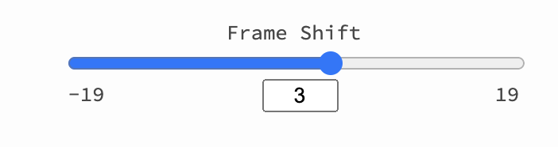
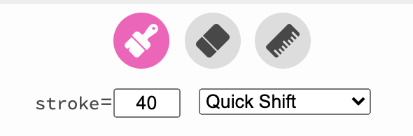
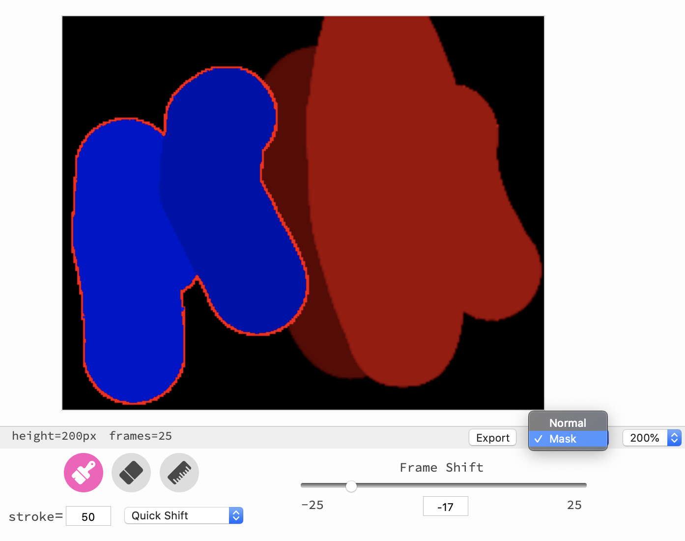

# Gif Shift

Web app for drawing in dimensions not only of sight but of time.


**Links**

- [Try it!][site]
- [Blog post][post]

**Related projects**

- [Scanline.gif](https://mattbierner.github.io/scanline-gif/) — Programmatically shifting which frame each pixel in a gif samples from.
- [Gif Mask](https://mattbierner.github.io/gif-mask/) — Remixing gifs using image masks.

## Usage

*Gif Shift* lets you edit gifs using a paintbrush that doesn't change the pixel contents of the gif, but instead changes which frame in the gif that pixel samples from. Imagine the brush as either pulling the painted pixels forwards in time so that they sample from future frames, or pushing them back so that sample from past frames. You can use this to create still images that sample from multiple frames of a gif or to create new animated gifs.

### Loading a gif

To load a gif, either:

- Drag and drop a gif from your computer to the timeline at the bottom of the screen.

- Use the search button next to the timeline to find a gif on Giphy.

Gif shift stores the loaded gif and editing state in your browser. No data is uploaded to a server.

### Editing

The editing tools in *Gif Shift* do not change the gif's pixel data but instead shift each pixel forward or backwards in time. The amount of shift is controlled by the `Frame Shift` slider:



With a frame shift of 3 for example, every pixel painted using the brush tool will sample from three frame in the future instead of from the current frame.

Gif Shift has a few basic tools to apply the shift:



- Brush (b) — Apply the current shift. The size of the brush is controlled by the `stroke`.
- Eraser (e) — Clear the current shift. The size of the eraser is controlled by the `stroke`.
- Line (g) — Draw a line that demarcates which part of the image should be shifted.
- Quick Shift — Quickly shift part of the image (such as the left side or bottom).

You can also view the current shift mask by selecting `mask` in the bottom bar of the editor:



- Black — No shift.
- 100% red — The pixel has been shifted the entire length of the gif forward.
- 30% red (dark red) — The frame has been shifted GIF_FRAME_COUNT * 0.30 frames forward.
- 100% blue — The pixel has been shifted the entire length of the gif backwards.
- 30% blue (dark blue) — The frame has been shifted GIF_FRAME_COUNT * 0.30 frames backwards.

## Building

The site is mainly written in TypeScript using react. It is bundled using webpack and served using [Jekyll](https://jekyllrb.com)

To run the site:

```bash
$ npm install
$ npm run build
$ Jekyll serve 
```

The main scripts are under `src/`. The bundled JavaScript is output to `js/`

## Credits

### Gif Encoder
Gif encoder from [GifCap](https://github.com/joaomoreno/gifcap).

### Icons 

- [Material Icons](https://material.io/resources/icons/?style=baseline)

- Brush, Move -  <a href="https://www.flaticon.com/free-icon/paint-brush_483917" title="Those Icons">Those Icons</a> from <a href="https://www.flaticon.com/" title="Flaticon">www.flaticon.com</a>

- Eraser: Icons made by <a href="https://icon54.com/" title="Pixel perfect">Pixel perfect</a> from <a href="https://www.flaticon.com/" title="Flaticon">www.flaticon.com</a>

- Ruler <a href="https://www.flaticon.com/authors/freepik" title="Freepik">Freepik</a> from <a href="https://www.flaticon.com/" title="Flaticon"> www.flaticon.com</a>


[site]: https://mattbierner.github.io/gif-shift/
[post]: https://blog.mattbierner.com/gif-shift